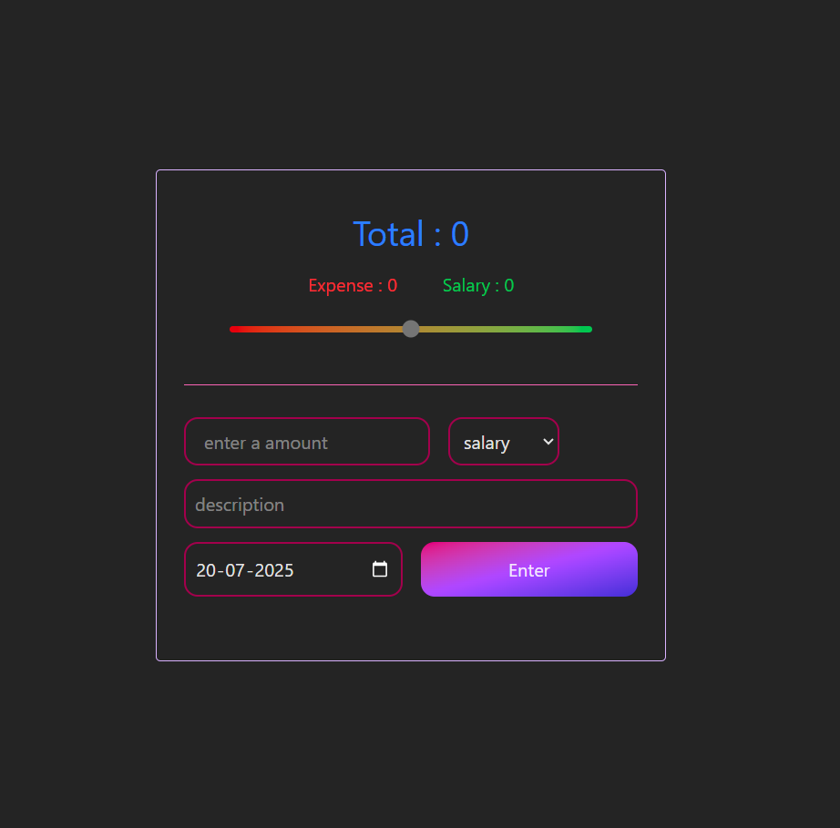
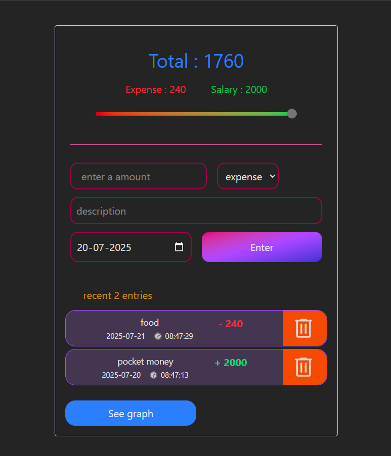
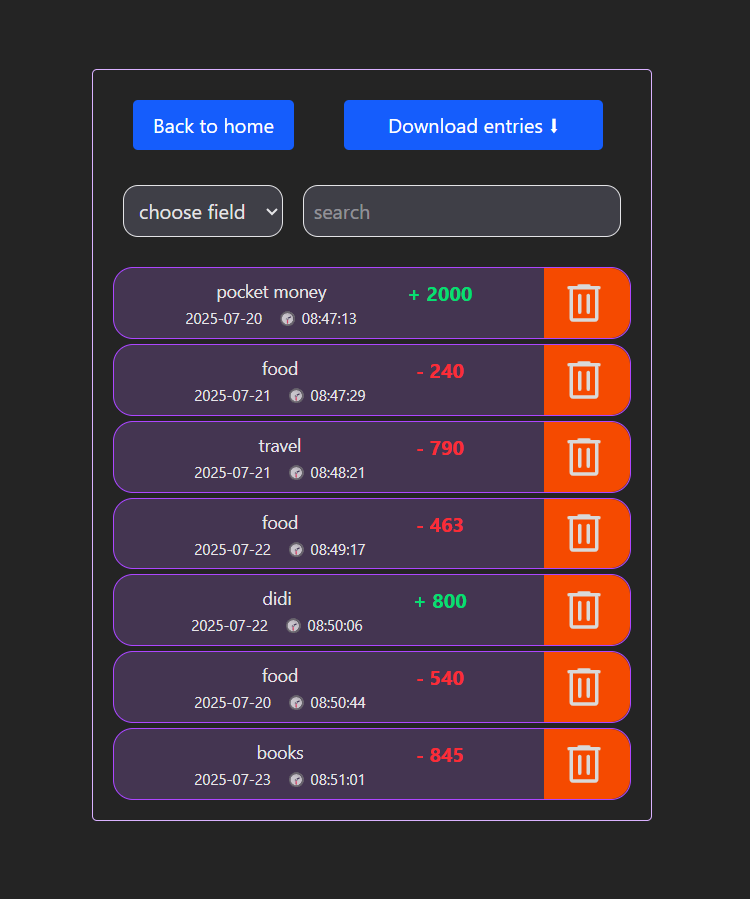
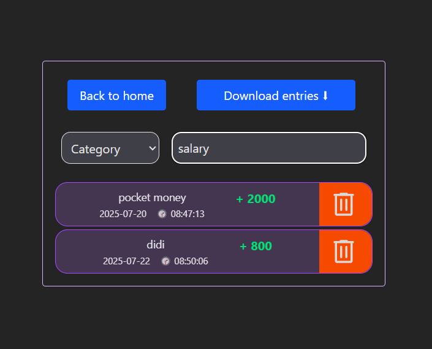
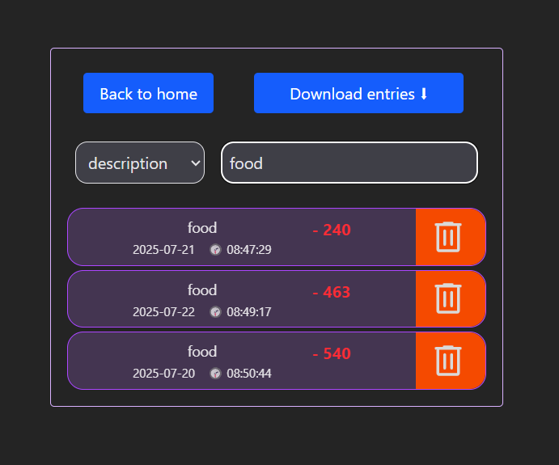
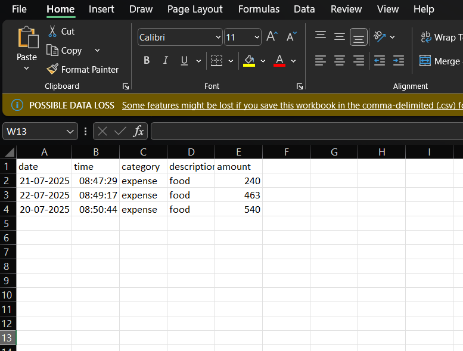
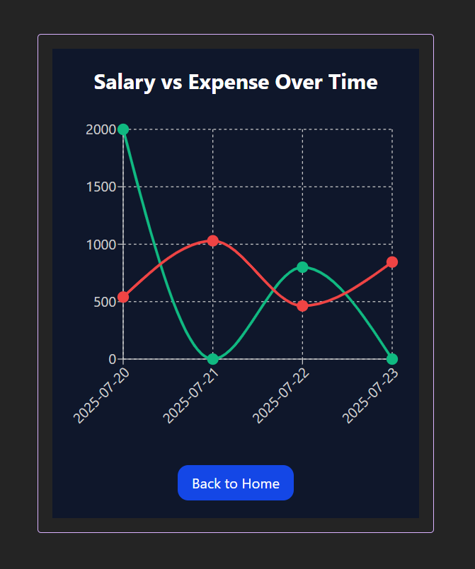

<h1 align="center">💸 Expense Tracker</h1>

<p align="center">
  A sleek, modern Expense Tracker built using <strong>React.js</strong>, <strong>Redux Toolkit</strong>, <strong>Tailwind CSS</strong>, <strong>React Router</strong>, <strong>Recharts</strong>, and <strong>React CSV</strong>.
  <br/>
  <br/>
  Easily track your salary, categorize your expenses, visualize with graphs, and export to CSV.
</p>

<p align="center">
  
  
  
</p>

---

## 🌟 Features

- 📝 Add Salary & Expenses with timestamps
- 🧠 Smart Filtering based on (category date, desciption.)
- 📊 Graph Visualization using Recharts (Line chart: Salary vs Expense over time)
- 📁 Export filtered data to CSV
- 💾 Persistent Storage with Redux + LocalStorage
- 🚀 Responsive, Modern UI built with Tailwind CSS
- 🔀 Seamless Page Navigation with React Router

---

## 🖼️ Screenshots

### 🏠 Home Screen (Add Salary & Expenses)
<div align="center">
  
  
  
</div>

---

### 🔍 Filter & Category View
<div align="center">
  
  
  
  
</div>

---

### 📈 Graph View (Salary vs Expense)
<div align="center">
  
</div>

---

## 🛠️ Tech Stack

| Tool            | Usage                          |
|-----------------|--------------------------------|
| React.js        | Frontend Framework             |
| Redux Toolkit   | State Management               |
| React Router    | Page Routing                   |
| Tailwind CSS    | Styling & Layout               |
| Recharts        | Data Visualization (Graphs)    |
| React CSV       | CSV Export Functionality       |

---

## 🧑‍💻 Getting Started

```bash
# Clone the repository
git clone https://github.com/Arun-Tomar13/Expense-Tracker.git

# Navigate to the folder
cd Expense-Tracker

# Install dependencies
npm install

# Run the project
npm run dev
```

📤 Export Feature
Navigate to Filter Page

Apply filters for 
- type(salary/expense)
- date
- desciption


Click Export CSV to download data

🌐 Routing Structure
/ – Home (Add Expense & Salary)

/filter – Filter Data

/graph – Line Chart Visualization

🙌 Credits
Created with ❤️ by Arun Tomar

📃 License
This project is open source and free to use.

---


